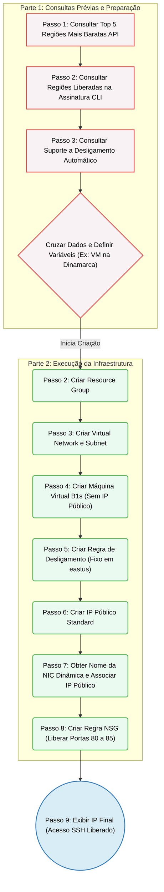

# Documentação da Infraestrutura

Abaixo está o fluxo completo de criação do nosso ambiente no Azure:




# Parte 1: Consultas Prévias (Preparação)
## Passo 1: Consultar o Top 5 regiões mais baratas globalmente (Versão Bash)

Linux
```bash
curl -s "https://prices.azure.com/api/retail/prices?currencyCode='USD'&\$filter=armSkuName%20eq%20'Standard_B2s'%20and%20priceType%20eq%20'Consumption'" | jq -r '.Items[] | select(.productName | contains("Windows") | not) | select(.productName | contains("Spot") | not) | "\(.armRegionName) \(.retailPrice)"' | sort -k2 -n | head -n 5
```

Windows
```bash
$uri = "https://prices.azure.com/api/retail/prices?currencyCode='USD'&`$filter=armSkuName%20eq%20'Standard_B2s'%20and%20priceType%20eq%20'Consumption'"
(Invoke-RestMethod -Uri $uri).Items | 
    Where-Object { $_.productName -notmatch "Windows" -and $_.productName -notmatch "Spot" } | 
    Sort-Object retailPrice | 
    Select-Object armRegionName, retailPrice -First 5 | 
    Format-Table
```

## Passo 2: Consultar quais regiões estão liberadas na SUA assinatura
```bash
az vm list-skus --size Standard_B2s --all --query "[?name=='Standard_B2s' && length(restrictions) == \`0\`].locations[0]" -o table
```

## Passo 3: Consultar regiões que suportam Desligamento Automático
```bash
az provider show --namespace Microsoft.DevTestLab --query "resourceTypes[?resourceType=='schedules'].locations | [0]" -o tsv
```

# Parte 2: Criação da Infraestrutura (Execução)
# Definindo Variáveis para não ter que digitar repetido (Altere se necessário) Variáveis
```bash
REGIAO="denmarkeast"
RG="RG-App-Novo"
VM_NOME="VirtualMachine"
VNET="vnet-denmark-b"
SUBNET="snet-denmark-b"
```

# 2. Criar Grupo de Recursos
```bash
az group create --name $RG --location $REGIAO
```

# 3. Criar Rede e Sub-rede
```bash
az network vnet create --resource-group $RG --name $VNET --location $REGIAO --address-prefix 172.16.0.0/16 --subnet-name $SUBNET --subnet-prefix 172.16.0.0/24
```

# 4. Criar a Máquina Virtual (Standard_B1s)
```bash
az vm create --resource-group $RG --name $VM_NOME --location $REGIAO --size Standard_B1s --image Ubuntu2204 --admin-username azureuser --generate-ssh-keys --vnet-name $VNET --subnet $SUBNET --public-ip-address ""
```

# 5. Criar a Regra de Desligamento (Fixo em eastus)
```bash
az vm auto-shutdown --resource-group $RG --name $VM_NOME --time 1600 --location eastus
```

# 6. Criar o IP Público no formato Standard
```bash
az network public-ip create --resource-group $RG --name ${VM_NOME}-PublicIP --location $REGIAO --allocation-method Static --sku Standard
```

# 7. Descobrir o nome dinâmico da Placa de Rede e Associar o IP
```bash
NIC_NOME=$(az vm show -g $RG -n $VM_NOME --query "networkProfile.networkInterfaces[0].id" -o tsv | awk -F'/' '{print $NF}')

az network nic ip-config update --resource-group $RG --nic-name $NIC_NOME --name ipconfig1 --public-ip-address ${VM_NOME}-PublicIP
```

# 8. Liberar as Portas 80 a 85 (protocolo TCP/HTTP)
```bash
az network nsg rule create --resource-group $RG --nsg-name ${VM_NOME}NSG --name Allow_APIs_80_85 --protocol Tcp --priority 100 --destination-port-ranges 80-85 --source-address-prefixes '*' --access Allow --direction Inbound
```

# 9. Mostrar o IP na tela para você conectar!
```bash
az network public-ip show --resource-group $RG --name ${VM_NOME}-PublicIP --query ipAddress --output tsv```
```
